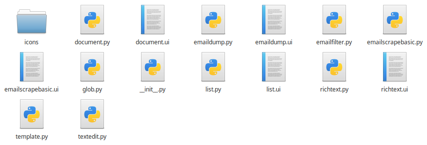

Create a Package
================

As this project is still young, creating a new package and its plugins is a
somewhat involved process. Don't worry though, these instructions should cover
all of the necessary steps to make a fully functioning package.

Creating the Package
--------------------

Creating a package is very similar to creating a Python package. First, create
a folder in which to contain the packages source material. Inside this folder,
we'll need to place a file called `__init__.py` which describes the package and
its contents. At the same level, we need to create a `plugin_name.py` as well
as a `plugin_name.ui` file for each plugin. These filenames must be different
for each plugin, but they won't be the "nice" name shown to the user. The
"nice" names can be duplicates, but why would you want to do that?

What you should end up with is a folder structure that looks something like
this:

You'll notice that there are some extra things in this folder which weren't
mentioned. Depending on the needs of your plugins, you may wish to provide
extra source material. In this case, `emailfilter.py`, `glob.py`,
`template.py`, and `textedit.py` are all extra files which contain code which
might be shared between plugins. These files can also be referenced *outside*
of this package by importing `PACKAGE_NAME.FILE` in a plugin's source code. The
folder `icons` contains special icons which are used by the `richtext.py`
plugin. Of course, these icons are available to any other plugin in this
package.

Next we need to fill out the `__init__.py` file in order to let ARCTool know
which Python files are plugins. The `__init__.py` file from above is shown
here:

.. literalinclude:: initExample
	:language: python

In the `__all__` property, the base names for each plugin are listed. The
`name` property determines the "nice" name of the package, which is displayed
to users. Note that when referencing the package in code, the name of the
folder containing the source code should be used, and not the "nice" name. The
`version` property is a tuple containing the (major, minor, release) version
numbers of the package. The `authors` property is a list of the names of the
package's authors.

The `preferenceDict` property describes the preferences which are displayed by
the preference manager. These preferences persist across report profiles, so
make sure that anything placed here isn't going to change often. Keys in the
dictionary are the tags used to store and retrieve values from the preference
manager. The vlaues of these keys are dictionaries describing the properties of
a given preference. These secondary dictionaries map a preference property
(key) to a property value (value.) Valid properties and values are:

	+---------------+-----------------------+--------------------------------------------------------------------+
	| Property      | Value                 | Description                                                        |
	+===============+=======================+====================================================================+
	| label         |<string>               |The text used for the label in the `Preference Manager` gui.        |
	+---------------+-----------------------+--------------------------------------------------------------------+
	| default       |<string>, <int>        |The default value of the                                            |
	|               |                       |preference. This differs the placeholder in that it                 |
	|               |                       |provides a value for the preference manager to                      |
	|               |                       |provide, even if the user hasn't filled in a value                  |
	+---------------+-----------------------+--------------------------------------------------------------------+
	| placeholder   |<string>, <int>        |A placeholder value hinting what the user should fill               |
	|               |                       |into the field. This does provide a default value, so               |
	|               |                       |if this preference is retrieved, it well still return `None`.       |
	|               |                       |                                                                    |
	|               |                       |This does not affect `check` or `choice` type preferences.          |
	+---------------+-----------------------+--------------------------------------------------------------------+
	| type          |string, check, number, |The type of preference this is. Currently, there are                |
	|               |choice                 |only these four options. String will store and return               |
	|               |                       |a string, check a boolean value, number an integer and              |
	|               |                       |choice a predetermined string (its ui widget is a combo box.)       |
	+---------------+-----------------------+--------------------------------------------------------------------+
	| tooltip       |<string>               |The text to be displayed as the widget's tooltip. As per            |
	|               |                       |`QTooltip standards <http://doc.qt.io/qt-5/qtooltip.html#details>`_ |
	|               |                       |this supports rich text formatting.                                 |
	+---------------+-----------------------+--------------------------------------------------------------------+

The prefernce manager takes care of saving and loading these preferences, and
accessing them is as simple as grabing the `PreferenceManager` singleton from
`arcpreferences.py` and using the two functions `getPreference` and
`setPreference`.

Now that the package as been defined, place the package's folder into
`~/.local/share/arctool/packages`. This will be cleaned up later after auto
importing package archives is added.

Creating a Plugin
-----------------

Unless you're some sort of savant, your first step should be to **copy** the
template plugin file. This will make sure that all the basic parts for the
plugin are present. That file is shown below:

.. literalinclude:: pluginTemplate
	:language: python

Let's break it down one step at a time.

.. literalinclude:: pluginTemplate
	:language: python 
	:lines: 1-3

First we import the necessary modules for plugins to work. From arcclasses,
we'll need the Plugin class which the new plugin will derive from. From QtGui
we get access to PyQt5's objects such as QDateTime or QTextCursor which may be
useful. From QtWidgets, we get access to PyQt's widgets such as QTextEdit or
QPushButton. Although these widgets are usually taken care of by the .ui file,
it helps to have access to these classes here in case we want to dynamicly add
widgets or design custom, composite widgets.

If any other modules are needed for this Plugin's Python code, they should be
included here. For example, it may be useful to import arctool in order to have
access to the main window's status bar via arctool.ARCTool.getStatusBar().

.. literalinclude:: pluginTemplate
	:language: python
	:lines: 5-23

These lines define the class and its constructor. Setting the `__name__`
property is typically against Python's best practice guidlines, but we do it
here to give the class a unique name without having to change the template in
multiple places. This name should correspond to the file name and also to the
.ui file which describes this plugin's settings. If they don't match, ARCTool
will be unable to load the plugin. The `name` property is the "nice" name,
which is used mostly in the gui to identify the plugin. This can be anything.
The `authors` property is a list of the authors' names. The `version` property
is a tuple containing the (major, minor, revision) version numbers. The
`description` property is a short description of the plugin's capabilities. The
`contexts` property is a list of the names of the contexts that this plugin is
compatible with. If a context from this list is not in use, the plugin will
simply not honour whatever context is. The `preferenceDict` property is used to
populate the preference manager with the appropriate preferences for this
plugin. Unlike the options or extras which change from instance to instance,
these preferences persist across instanaces and profiles. When designing a
plugin, think carefully what paramaters should persist at the package level,
the plugin level or the instance level (options and extras.)

One property that is inhereted from the Plugin class is the `widget` property.
This property holds the top level QWidget representing the plugin's gui. The
gui is described by a .ui file bearing the same base name as the plugin source
file. The .ui file can be written by hand (it's just XML) or generated by
QtCreator's design tool. Some other inherited properties are `options` and
`extras`.

.. literalinclude:: pluginTemplate
	:language: python
	:lines: 25-26

This function is what sets up the plugin's gui which is displayed in the main
window. By default this does nothing, but if you need to connect any signals or
set icons or anything else related to the guy, that should be done here.

.. literalinclude:: pluginTemplate
	:language: python
	:lines: 28-29

This function is what recalls the options and extras when the module is loaded
from a saved profile. This is as simple as looking in `self.options` or
`self.extras` for the appropriate key. It should be noted that gui widgets
whose properties were stored in `options` will automatically have their
properties restored. In fact, please don't store anything other than widget
properties in `options`.

.. literalinclude:: pluginTemplate
	:language: python
	:lines: 31-32

This function stores the properties of gui widgets into `self.options` and
other information into `self.extras`. These must be indicated manually such as

.. code-block:: python

	self.options['imageCheck'] =\
		(self.widget.imageCheck.isChecked(), 'checked')

for widgets or

.. code-block:: python

	self.extras['filters'] = self.widget.emailFilterTable.serialize()

for extras.

.. literalinclude:: pluginTemplate
	:language: python
	:lines: 34-38

This function is what generates the QTextDocument which is compiled into the
main report. Information on the QTextDocument class can be found in the
`QT Documentation of the class <http://doc.qt.io/qt-5/qtextdocument.html>`_.
Basically, the QTextDocument holds richtext data which can be read and edited
as html or with the `QTextCursor <http://doc.qt.io/qt-5/qtextcursor.html>`_ 
class. Whatever your plugin does behind the scenes the only end point it must
reach is to deposite some resulting text into the QTextDocument which this
function returns.

Beyond these parts, your Plugin subclass can implement any functions or member
variables necessary to achieve your goal. Any Python modules you have access to
on your system will be available to your plugin, and plugins can import other
source files from within the package.